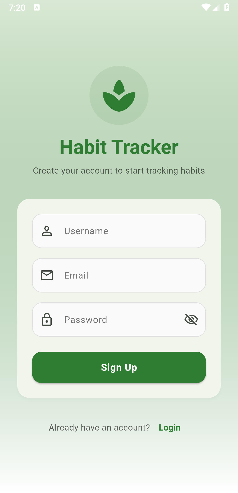
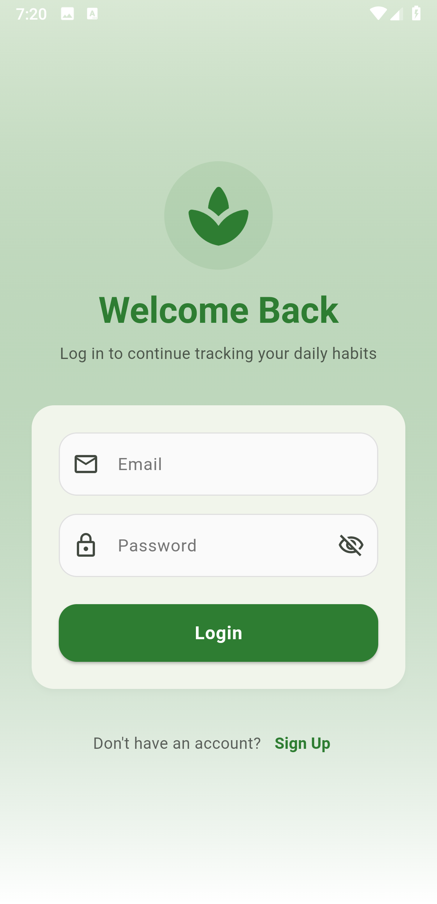
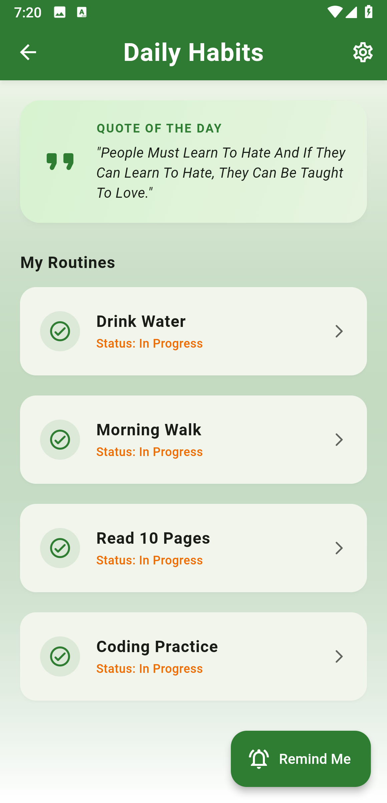
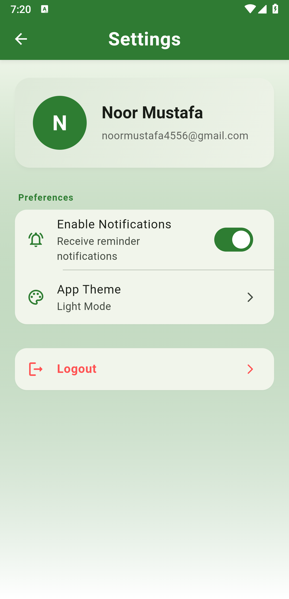
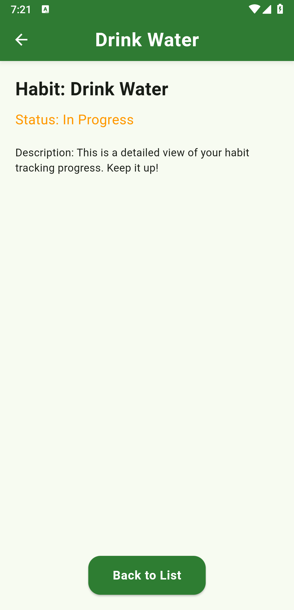
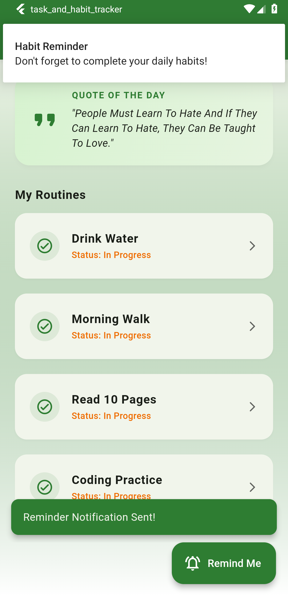
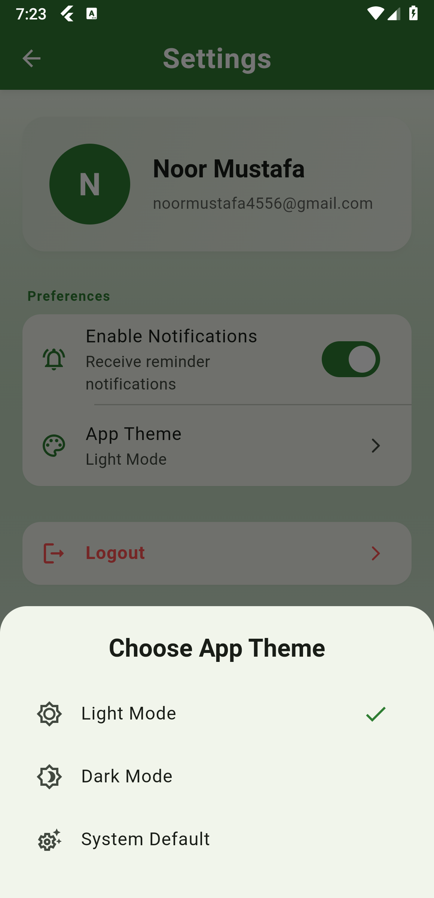

# Habit Tracker & Daily Quotes App (Capstone Project)

A cross-platform mobile application built with Flutter that helps users track their daily habits and stay motivated with real-time quotes.

## Features
- **User Authentication:** Secure Signup and Login screens.
- **Dynamic Content:** Fetches daily motivational quotes from an external API (dummyjson.com).
- **Persistence:** Uses `shared_preferences` to save user data locally.
- **Notifications:** Integrated local notifications to remind users of their habits.
- **Modern UI:** Built using Material 3 design principles.

## Tech Stack
- **Framework:** Flutter
- **Language:** Dart
- **State Management:** StatefulWidget
- **API:** HTTP Package
- **Storage:** Shared Preferences
- **Notifications:** Flutter Local Notifications

## Setup Instructions
1. Clone the repository: `git clone https://github.com/NoorMustafa4556/Task-Habit-Tracker-App-Flutter.git`
2. Install dependencies: `flutter pub get`
3. Run the app: `flutter run`

## Screenshots
Here are the screenshots showing the lavish UI redesign and feature updates of the application:

| Signup / Login & UI | Home & Settings Screens |
| :---: | :---: |
|  |  |
|  |  |
|  |  |
|  | |
